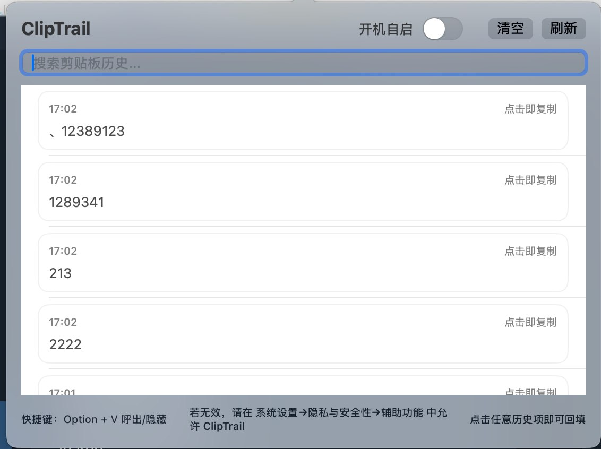

# ClipTrail (macOS)

一个真正可日用的 macOS 剪贴板历史软件（GUI + 常驻菜单栏 + 快捷键呼出）。

## 现在具备的体验

- ✅ 原生 GUI（SwiftUI）
- ✅ 菜单栏常驻（📋）
- ✅ 全局快捷键：**Option + V** 呼出 / 隐藏窗口（Carbon 注册，更稳定）
- ✅ 窄边弹窗模式（更像 Windows 呼出体验）
- ✅ 搜索历史记录
- ✅ 新内容自动滚到最前
- ✅ 支持文本 / 图片 / 文件历史
- ✅ 自动检查 GitHub 新版本，并支持软件内下载更新包（DMG）
- ✅ 点击条目即复制回填 + 成功 Toast 提示
- ✅ 开机自启开关（UI 内）
- ✅ GitHub Actions 自动构建 macOS 产物
- ✅ 提供 `.dmg` 可安装包

## 使用方式（推荐）

1. 从 GitHub Actions 下载 `ClipTrail.dmg`
2. 双击打开并拖入 Applications
3. 启动 ClipTrail
4. 之后可用 `Option + V` 随时呼出

> 如果 macOS 仍提示“已损坏/无法验证”，执行一次：
>
> ```bash
> xattr -dr com.apple.quarantine /Applications/ClipTrail.app
> ```

## 功能说明

- 软件持续监听剪贴板变化（文本 / 图片 / 文件）
- 历史数据保存在：
  `~/Library/Application Support/ClipTrail/history.json`
- 在 GUI 界面中可：
  - 搜索
  - 刷新
  - 清空
  - 点击条目回填到系统剪贴板

## 界面演示

### 主界面（卡片历史 + 搜索）



## 开机自启

GUI 顶部有“开机自启”开关。打开后会尝试注册为登录项（macOS 13+）。

## 开发与构建

```bash
swift build -c release
./.build/release/cliptrail gui
```

## CI 产物

Workflow 会上传：
- `ClipTrail.dmg`
- `ClipTrail.app`
- `com.stanley.cliptrail.plist`

## 技术细节

详细技术文档：
- [docs/TECHNICAL.md](docs/TECHNICAL.md)

## 署名

Maintainer: Stanley
